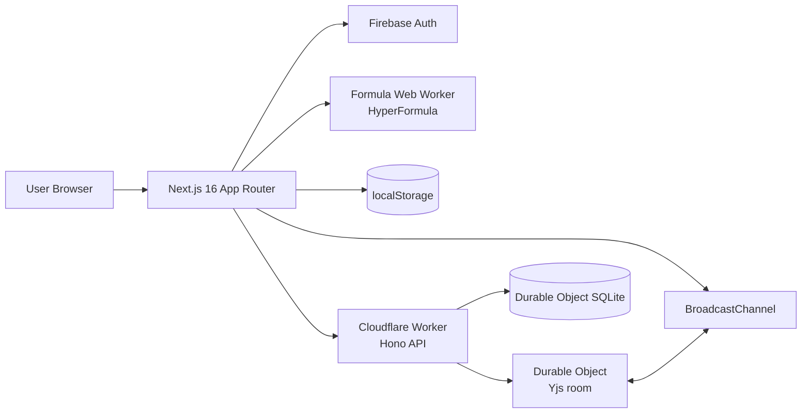
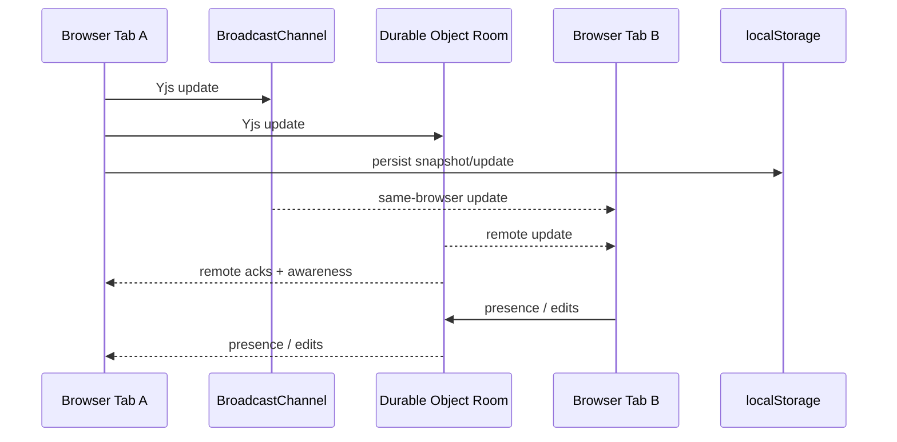
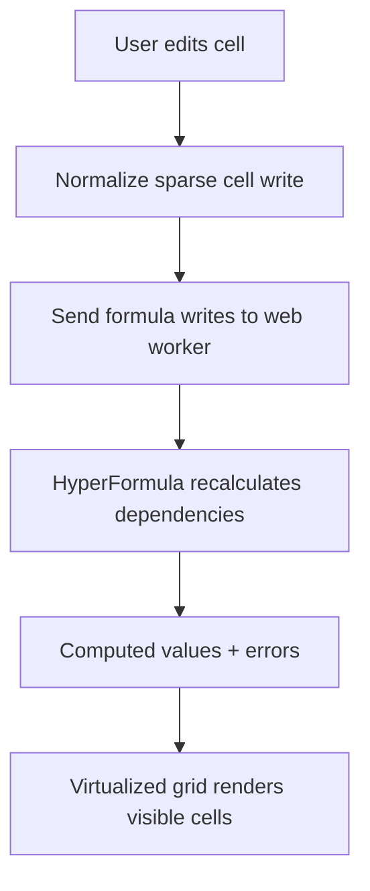
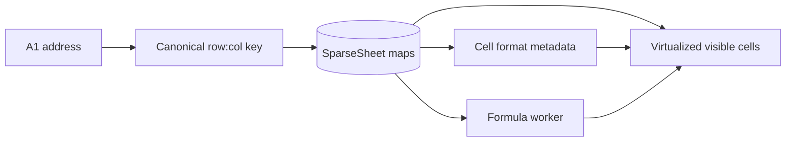

# Pebbles

Pebbles is a real-time collaborative spreadsheet built for the Trademarkia frontend engineering assignment. It combines a virtualized spreadsheet UI, live multi-user editing and presence, formula evaluation in a dedicated worker, and a Cloudflare-backed collaboration layer.

## What This Submission Covers

The implementation covers the full required scope and the requested spreadsheet interaction depth:

| Area | Status | Notes |
| --- | --- | --- |
| Dashboard | Complete | Document cards with title, owner, last modified metadata, create/open/delete flows, and sign-out |
| Spreadsheet grid | Complete | 100 columns x 10,000 rows, row/column headers, editable cells, virtualized rendering |
| Formulas | Complete | `=SUM(...)`, arithmetic, ranges, references, dependency updates, and error handling |
| Real-time sync | Complete | Yjs document sync over BroadcastChannel + WebSocket, with local persistence |
| Presence | Complete | Avatars, colors, selections/cursors, and collaborator metadata |
| Identity | Complete | Firebase Google sign-in with guest fallback |
| Write status | Complete | Explicit sync states for saving, saved, reconnecting, and offline |
| Bonus features | Complete | Formatting, resize, keyboard navigation, reorder, and export support |

## Product Snapshot

- `Dashboard`: create, rename, open, and delete spreadsheet documents
- `Editor`: sparse, virtualized grid with inline editing and formula bar
- `Collaboration`: live cursors, presence, cross-tab sync, reconnect handling
- `Spreadsheet UX`: keyboard navigation, row/column resize, drag reorder, sorting, search/replace, export, and formatting

## Architecture



### Frontend

- `Next.js 16` with App Router
- `React 19` client components for dashboard and spreadsheet interactions
- `Tailwind CSS v4` for styling
- `TypeScript` in `strict` mode

### Realtime + Collaboration

- `Yjs` as the shared CRDT document model
- `BroadcastChannel` for instant same-browser tab sync
- `WebSocket` transport to a Cloudflare Durable Object for cross-client sync
- `localStorage` persistence for fast reload recovery and offline continuity

### Backend

- `Cloudflare Worker` with `Hono` for document metadata and room routing
- `Durable Objects` for per-document collaboration rooms
- Durable Object `SQLite` storage for metadata persistence

### Formula Engine

- `HyperFormula` running inside a dedicated web worker
- Main-thread spreadsheet interactions stay responsive while formulas recalculate

## Real-Time Sync Model



Why three layers instead of only WebSocket:

- `BroadcastChannel` removes needless server hops for two tabs in the same browser
- `WebSocket` handles true multi-user collaboration
- `localStorage` gives fast state recovery after refresh and supports temporary offline continuity

This is more than the assignment strictly required, but it improves perceived responsiveness and failure handling without changing the editing model.

## Formula Evaluation Flow



The formula scope is intentionally narrow even though the engine is capable of more:

- arithmetic such as `=A1+B1`
- cell references
- ranges such as `A1:B5`
- `SUM(...)`
- dependency updates and formula errors

That keeps the feature set aligned with the rubric while still giving robust recalculation semantics.

## Why These Technical Choices

### Why HyperFormula instead of a hand-rolled parser

The assignment only required `SUM` and basic arithmetic. A custom parser would have been valid, but I chose `HyperFormula` for three reasons:

1. Dependency tracking matters more than parsing syntax alone in a spreadsheet.
2. Formula error states and update propagation are easy to get subtly wrong.
3. Running it in a dedicated worker keeps the UI responsive under recalculation.

### Why Cloudflare Workers + Durable Objects instead of Firebase as the backend

The assignment suggested Firebase "or equivalent." I used Cloudflare Workers and Durable Objects because the collaboration problem maps naturally to a per-document room:

- each spreadsheet document already behaves like a dedicated collaboration room
- Durable Objects provide a single coordination point per room
- WebSockets and presence fit cleanly into the Durable Object lifecycle
- metadata can live close to the room routing layer

Tradeoff:

- This is more infrastructure than the assignment required.
- Firebase would have reduced backend code and matched the prompt more literally.

Why the choice is still defensible:

- it keeps the metadata API and live collaboration transport in one deployment model
- it demonstrates deterministic room ownership and synchronization boundaries
- it avoids bolting a separate socket layer onto a metadata backend later

### Why Yjs instead of manual conflict resolution

Real-time spreadsheet editing is mostly a state synchronization problem, not a REST problem. Yjs handles:

- concurrent edits
- presence awareness
- incremental updates
- reconnection and replay semantics

That let me spend time on spreadsheet behavior instead of inventing CRDT conflict resolution from scratch.

### Why virtualize the grid

Even though only a sparse subset of cells usually contains data, a spreadsheet still needs to feel large. Rendering the entire `100 x 10,000` grid would create avoidable DOM and paint costs. Virtualization ensures:

- constant-ish rendering cost relative to viewport size
- sparse writes stay cheap
- resizing, scrolling, and selection remain responsive

This is one area where "overbuilding" is justified for a spreadsheet UI.

## Assignment Feature Map

### Required Features

| Requirement | Implementation |
| --- | --- |
| 1. Dashboard | `src/features/dashboard/dashboard-shell.tsx` |
| 2. Scrollable spreadsheet grid | `src/features/spreadsheet/virtualized-sheet.tsx` + sparse sheet model |
| Rows numbered / columns lettered | A1 addressing helpers in `src/features/spreadsheet/addressing.ts` |
| Editable cells | Inline editor + formula bar |
| `=SUM` and arithmetic | `src/features/formulas/` |
| Real-time collaboration | `src/features/collaboration/use-collaboration-room.ts` + `src/lib/yjs/` |
| Write-state indicator | `src/features/spreadsheet/hooks/use-write-state.ts` |
| Presence UI | `src/features/documents/collaborator-bar.tsx` + spreadsheet peer overlays |
| Identity | `src/features/auth/auth-provider.tsx` |
| Type-safe build | TypeScript strict mode, Ultracite/Biome checks |

### Bonus Features

| Feature | Notes |
| --- | --- |
| Cell formatting | Bold, italic, underline, alignment, text color, fill color, font family, font size |
| Resize | Row/column drag resizing |
| Keyboard navigation | Arrow keys, tabbing, enter, delete, shortcuts |
| Reorder | Drag rows/columns |
| Export | CSV, TSV, and JSON |

## Local Development

### 1. Install dependencies

```bash
bun install
cd worker && bun install && cd ..
```

### 2. Configure environment variables

Copy `.env.example` to `.env.local` and fill in your Firebase project config:

```bash
cp .env.example .env.local
```

Required variables:

| Variable | Purpose |
| --- | --- |
| `NEXT_PUBLIC_FIREBASE_API_KEY` | Firebase client auth |
| `NEXT_PUBLIC_FIREBASE_APP_ID` | Firebase app identifier |
| `NEXT_PUBLIC_FIREBASE_AUTH_DOMAIN` | Firebase auth domain |
| `NEXT_PUBLIC_FIREBASE_MEASUREMENT_ID` | Firebase analytics config |
| `NEXT_PUBLIC_FIREBASE_MESSAGING_SENDER_ID` | Firebase messaging identifier |
| `NEXT_PUBLIC_FIREBASE_PROJECT_ID` | Firebase project id |
| `NEXT_PUBLIC_FIREBASE_STORAGE_BUCKET` | Firebase storage bucket |
| `NEXT_PUBLIC_API_URL` | Cloudflare Worker base URL for REST + WebSocket |

Notes:

- Google sign-in is optional at runtime because the app also supports guest identity
- `NEXT_PUBLIC_API_URL` should point to your local `wrangler dev` URL in development, usually `http://localhost:8787`

### 3. Run the worker

```bash
bun run dev:worker
```

### 4. Run the Next.js app

In another terminal:

```bash
bun run dev
```

Open `http://localhost:3000`.

## Scripts

### Frontend

| Command | Purpose |
| --- | --- |
| `bun run dev` | Start Next.js dev server |
| `bun run build` | Production build |
| `bun run start` | Run production app |
| `bun run test` | Run Bun test suite |
| `bun run typecheck` | TypeScript no-emit check |
| `bun run check` | Ultracite/Biome lint check |
| `bun run fix` | Ultracite/Biome auto-fix |

### Worker

| Command | Purpose |
| --- | --- |
| `cd worker && bun run dev` | Start local Cloudflare Worker |
| `cd worker && bun run deploy` | Deploy worker |
| `cd worker && bun run typecheck` | Worker TypeScript check |

## Project Structure

```text
src/
  app/
    dashboard/
    documents/[documentId]/
  features/
    auth/
    collaboration/
    dashboard/
    documents/
    formulas/
    spreadsheet/
      functions/
      hooks/
      types/
      ui/
  lib/
    firebase/
    metadata/
    yjs/
  workers/
    formula.worker.ts
  types/
worker/
  src/
    collab-document.ts
    index.ts
    metadata-store.ts
    transport-protocol.ts
```

## Spreadsheet Model

The editor is built around a sparse data model rather than a dense 2D array.



This keeps memory and update costs proportional to actual cell usage, not theoretical sheet size.

## User Experience Details

### Editing

- single click selects a cell
- double click or typing starts editing
- formula bar mirrors the active cell
- cell edits sync to collaborators live

### Presence

- collaborator avatars are shown in the document header
- remote selections/cursors are colored and visible on the grid
- collaborator name and color are derived from the current identity session

### Reliability

Write state is surfaced explicitly:

- `idle`
- `saving`
- `saved`
- `reconnecting`
- `offline`

That gives users feedback about whether their edits have landed.

## Known Tradeoffs and Limitations

### Deliberate tradeoffs

- The backend is heavier than the prompt demanded because the collaboration layer was treated as a first-class system, not a mocked transport.
- Formula support is intentionally rubric-focused even though HyperFormula can do much more.
- The sync stack is deeper than strictly necessary, but it improves same-browser responsiveness and offline resilience.

## What I Would Build Next

If this moved from assignment to product work, the next steps would be:

1. Add server-authorized document sharing and room join authorization.
2. Introduce a permission model for owner/editor/viewer access.
3. Decide whether to keep HyperFormula behind an abstraction or replace it.
4. Continue decomposing the spreadsheet orchestration layer into smaller, more isolated render/update paths.
5. Add more spreadsheet-native features only after measuring interaction latency on large documents.

## Verification

The project is maintained with:

- `TypeScript` strict mode
- `Ultracite` / `Biome` formatting and linting
- Bun tests for spreadsheet and formula behavior

Recommended verification commands before submission:

```bash
bun run typecheck
bun run check
bun run test
cd worker && bun run typecheck
```
